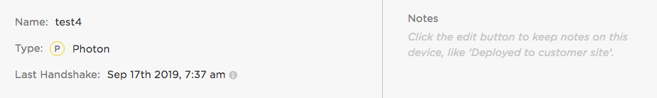
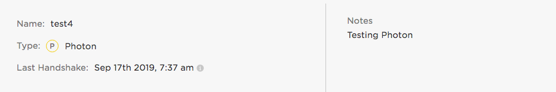
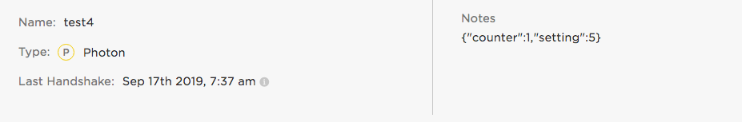
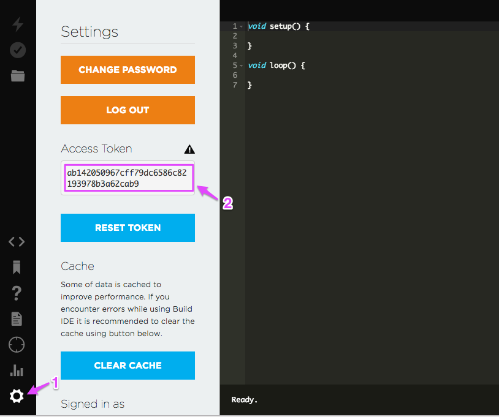

# DeviceNotesHelperRK

*Utilities for using device notes from Particle devices*

You should really [Ledger](https://docs.particle.io/getting-started/logic-ledger/ledger/) which is built into Device OS and the Particle
platform and is a much better way to store configuration settings.

---

When you open a device in the [console](https://console.particle.io) there's a section on the right for notes. 



You can edit them using the **Edit** button and typically you use a textual description.



However, you don't have to. One interesting technique is to store structured data in JSON there. You can set or get the data from the device itself (using webhooks) and also get or set the data using the Particle Cloud API. 



This repository contains a library for Particle devices and some sample code for using this from other places.

Some reasons you might want to do this:

- Have per-device settings stored in the cloud but downloaded to the device, allowing a single firmware binary to be used.
- Provide a way for a device to store a small amount of data in the cloud, without requiring a 3rd-party service or server.

Using functions and variables is usually easier, and if you have your own server, monitoring published events using webhooks or the Server-Sent-Events stream (SSE) is generally more efficient. However, in some limited use-cases, this technique is kind of handy!

## Get an access token

The curl and node.js examples assume an environment variable `AUTH_TOKEN` that contains a valid Particle authentication token. You can create one using the API or get on from the [Web IDE](https://build.particle.io) Settings (gear icon).



In this case, the token is ab142050967cff79dc6586c82193978b3a62cab9.

For Mac and Linux:

```
export AUTH_TOKEN=ab142050967cff79dc6586c82193978b3a62cab9
```

For Windows:

```
set AUTH_TOKEN=ab142050967cff79dc6586c82193978b3a62cab9
```

You'll also need this access token to paste into your webhook.

## Create the webhooks

This technique requires two webhooks, one to get data and one to set it. The easiest way is to edit the access_token, then upload it from the Particle CLI.

```
{
    "event": "DeviceNotesGet",
    "url": "https://api.particle.io/v1/devices/{{PARTICLE_DEVICE_ID}}",
    "query": {
    	"access_token": "ab142050967cff79dc6586c82193978b3a62cab9"
    },
    "requestType": "GET",
    "responseTopic": "{{{PARTICLE_DEVICE_ID}}}/DeviceNotesResponse",
    "responseTemplate": "{{{notes}}}",
    "mydevices": true,
    "noDefaults":true
}
```

For example, in the webhooks directory:

```
particle webhook create DeviceNotesGet.json
```

If you edit the webhook again, make sure you use `particle webhook delete` to delete the old one first! The `particle webhook create` command always creates a new one, even if there is already one with the same event trigger, and both will trigger.


There's also a webhook for the `DeviceNotesPut` command. You can omit this if you only read data from the cloud and never set the notes from a device.

```
{
    "event": "DeviceNotesPut",
    "url": "https://api.particle.io/v1/devices/{{PARTICLE_DEVICE_ID}}",
    "query": {
    	"access_token": "ab142050967cff79dc6586c82193978b3a62cab9"
    },
    "requestType": "PUT",
    "json": {
    	"notes":"{{{PARTICLE_EVENT_VALUE}}}"
    },
    "mydevices": true,
    "noDefaults":true
}
```

You can also enter the webhooks manually into the Console web interface, if you prefer.

## Using the library

The library examples are the best way to see how to use the library. However, the underlying [JsonParserGeneratorRK](https://github.com/rickkas7/JsonParserGeneratorRK) documentation may also be helpful.

There is also the helpful [JSON code generator](https://rickkas7.github.io/jsonparser). Paste your JSON code into the box and click on a row in the parsed output and it will generate the code you need to access that element.

The full [DeviceNotesHelperRK library documentation](https://rickkas7.github.io/DeviceNotesHelperRK/index.html) is browsable online.


## Library Examples

### 1-simple

The 1-simple example shows how to read a single JSON value ("setting") from the cloud at boot. This can easily be extended to other things.

Here's a description of the the code:

```
#include "DeviceNotesHelperRK.h"

SYSTEM_THREAD(ENABLED);

SerialLogHandler logHandler;

DeviceNotesHelper deviceNotesHelper;
```

Standard boilerplate stuff. The code works with threading enabled or disabled. The `SerialLogHandler` is optional to display debugging info to the USB serial port.

It's common to allocate a single `DevicesNoteHelper` object as a global variable.

```
void setup() {
	// Override settings here
	deviceNotesHelper
		.withBufferSize(1024) 	// Allow a JSON object up to 1024 bytes
		.withGetAtBoot();	 	// Fetch the devices notes once at boot after connecting to the cloud
```

You typically configure the `DeviceNotesHelper` in `setup()`. In this case, we set the maximum JSON object size (1024 bytes) and get the device notes once at boot. You can also get the data periodically using `withGetPeriodic()`.

```
	deviceNotesHelper.withDataUpdatedCallback([](JsonParser &jp) {
		// This function gets called when the data is updated at boot time. We just print the
		// data here, but you could do something more useful with it.

		int setting = 0;
		jp.getValueByKey(jp.getOuterObject(), "setting", setting);

		Log.info("received setting=%d", setting);
	});
```

This is a C++11 lambda. You could put the code in a separate function if you prefer. The important part is that the code inside the { } gets run when the device notes are downloaded from the cloud. 

In this example, we get the `setting` key from the device notes (an int variable) and print it to the serial debug console.

```
	// You must call this from setup!
	deviceNotesHelper.setup();
}
```

Make sure you call `deviceNotesHelper.setup();` from `setup()`!


```
void loop() {
	// You must call this from loop, preferably every loop but at least every few seconds.
	deviceNotesHelper.loop();
}
```

Make sure you call `deviceNotesHelper.loop();` from `loop()`!

### 2-counter

The 2-counter example shows how to both get an object from the cloud, as well as update it from the device. 

This technique can be used to save a small amount of data from the device in the cloud without needing additional servers or 3rd-party services, even when the device is offline.

For devices that are online all the time, Particle variables might be a better choice.

And at larger scales, having a server that stores the last value from Particle.publish using webhooks or SSE (server sent events) is far more efficient.

The object is limited to the size of a single publish, so 622 bytes.

Still, it's an interesting technique!

```
#include "DeviceNotesHelperRK.h"

SYSTEM_THREAD(ENABLED);

SerialLogHandler logHandler;

DeviceNotesHelper deviceNotesHelper;
```

Standard boilerplate stuff. The code works with threading enabled or disabled. The `SerialLogHandler` is optional to display debugging info to the USB serial port.

It's common to allocate a single `DevicesNoteHelper` object as a global variable.

```
const unsigned long UPDATE_COUNTER_PERIOD = 60000; // Once a minute
unsigned long lastUpdateCounter = 0;

void incrementCounter();
```

Some settings we use in our code and a forward declaration of the `incrementCounter()` function.

```
void setup() {
	// Override settings here
	deviceNotesHelper.withBufferSize(640); // Allow a JSON object up to 640 bytes
	deviceNotesHelper.withGetAtBoot();
```

Setting up the configuration. We have a maximum data size of a single publish because we set the data, so 640 bytes. We also get the data at boot.

```
	deviceNotesHelper.withDataUpdatedCallback([](JsonParser &jp) {
		// This function gets called when the data is received from the cloud
		lastUpdateCounter = millis();
		incrementCounter();
	});
```

The code in the { } gets executed whenever the data is received from the cloud. We track when that happened and increment the counter (see below).

```
	// You must call this from setup!
	deviceNotesHelper.setup();
}
```

Don't forget to call `deviceNotesHelper.setup()` from `setup()`!

```
void loop() {
	if (millis() - lastUpdateCounter >= UPDATE_COUNTER_PERIOD && Particle.connected()) {
		lastUpdateCounter = millis();

		if (!deviceNotesHelper.hasData()) {
			// We didn't update from the cloud at boot successfully, so try to get data again
			deviceNotesHelper.getFromCloud();
		}
		else {
			// We have saved data, so just increment the value we got last time
			// rather than doing both a get and set
			incrementCounter();
		}
	}
```

This code periodically (every `UPDATE_COUNTER_PERIOD` milliseconds) while connected to the cloud, increments the counter and saves the value to the device notes.

```
	// You must call this from loop, preferably every loop but at least every few seconds.
	deviceNotesHelper.loop();
}
```

Don't forget to call `deviceNotesHelper.loop()` from `loop()`!

```
void incrementCounter() {
	JsonParser &jp = deviceNotesHelper.getJsonParser();

	int counter = 0;
	jp.getValueByKey(jp.getOuterObject(), "counter", counter);

	JsonModifier mod(jp);
	mod.insertOrUpdateKeyValue(jp.getOuterObject(), "counter", ++counter);

	Log.info("counter=%d", counter);

	deviceNotesHelper.putToCloud();
}
```

This code gets the `counter` value that we previously got from the cloud and modifies the JSON to increment the value by 1.

Then it uses the `deviceNotesHelper.putToCloud()` method to put the modified data to the cloud. It does a `Particle.publish()` which is transformed to a Particle API call by a webhook.

### 3-print

The 3-print example is more or less like 1-simple, but it also shows how to pretty print the entire JSON object. Works with larger objects.

## More about JsonParser

To decode the JSON data you use the `JsonParser` object. It's passed into your callback.

Say you have this object:

```
{
  "t1":"abc",
  "t2":1234,
  "t3":1234.5,
  "t4":true,
  "t5":false,
  "t6":null,
  "t7":"\"quoted\""
}
```

You could read the value of t1 by using [getOuterValueByKey](http://rickkas7.github.io/JsonParserGeneratorRK/class_json_parser.html#a38858994342cd2735b716b117bf8afdf) and this code:

```
String strValue;
jp.getOuterValueByKey("t1", strValue);
```

This also works for other data types:

```
int intValue;
jp.getOuterValueByKey("t2", intValue)

float floatValue;
jp.getOuterValueByKey("t3", floatValue);

bool boolValue;
jp.getOuterValueByKey("t4", boolValue);
```

You can also read values of nested objects, arrays, etc. but you probably won't need to do that with device notes.

## More about JsonModifier

Assuming your `JsonParser` is in the variable `jp` you then construct a temporary modifier object on the stack like this:

```
JsonModifier mod(jp);
```

The most common thing to do is have a JSON object and you want to update the value, or insert the value if it does not exist:

```
mod.insertOrUpdateKeyValue(jp.getOuterObject(), "t2", (int)999);
```

If the input JSON was as above, then it would be changed to:

```
{
  "t1":"abc",
  "t3":1234.5,
  "t4":true,
  "t5":false,
  "t6":null,
  "t7":"\"quoted\"",
  "t2":999
}
```

You can add int, long, float, double, bool, and const char * objects this way.

```
mod.insertOrUpdateKeyValue(jp.getOuterObject(), "t1", "testing");
```

Updating an object will remove it from its current location and add it at the end of the object.

Another common function is `appendArrayValue()` which appends to an array.

You can also use `removeKeyValue()` and `removeArrayIndex()` to remove keys or array entries.

## Updating notes using the Cloud API


### Using curl

To get the device notes you get the device information. You must have the device ID (in this example, 1e0032000447343138333038), as well as the access token as described above.

```
curl "https://api.particle.io/v1/devices/1e0032000447343138333038?access_token=$AUTH_TOKEN"
```

This returns a JSON object with the device information. In it, you might see this field with the notes set as above. It's the JSON, though it's a string, not actually a JSON object.

```
"notes":"{\"counter\":1,\"setting\":5}"
```

To set the value using curl is a bit awkward, but this changes the setting to 6:

```
curl -X PUT -H "Content-Type: application/json" -d '{"notes":"{\"counter\":1,\"setting\":6}"}' "https://api.particle.io/v1/devices/1e0032000447343138333038?access_token=$AUTH_TOKEN"
```

When updating the data by curl you must include the whole data, not just the field you want to update. There is a possibility of update conflicts because of this, so this doesn't really take the place of using a proper database.

## Version History

### 0.0.3 (2025-03-17)

- Add warning to switch to Ledger
- Switch to using a Device ID prefix on the subscription by default

### 0.0.2 (2021-01-07)

- Upgrade to JsonParserGeneratorRK 0.1.4
- Use addChunked to support out-of-order multipart webhook responses


